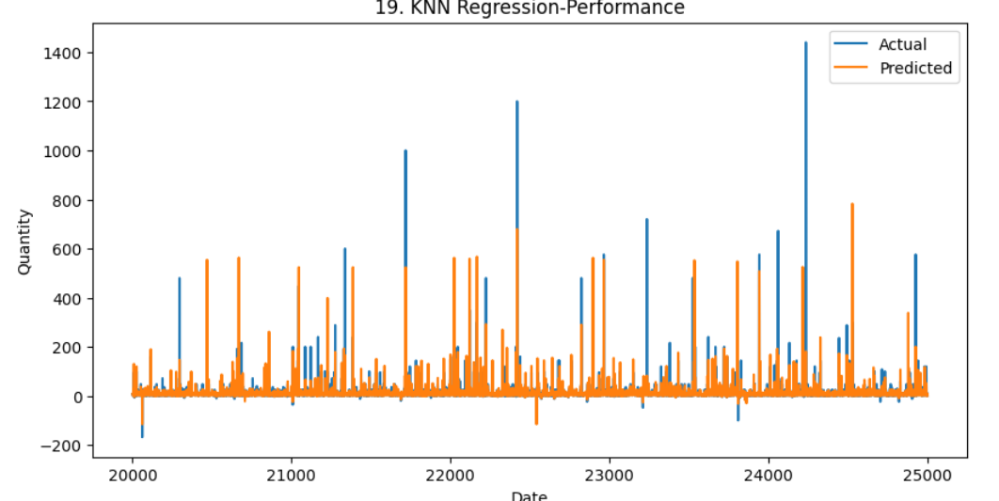
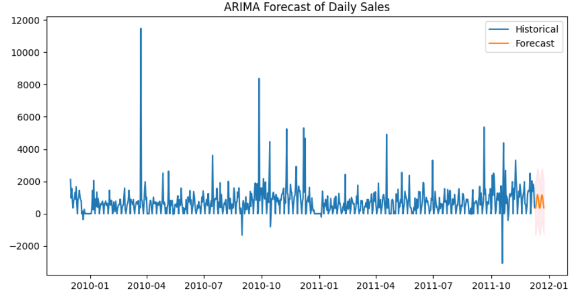
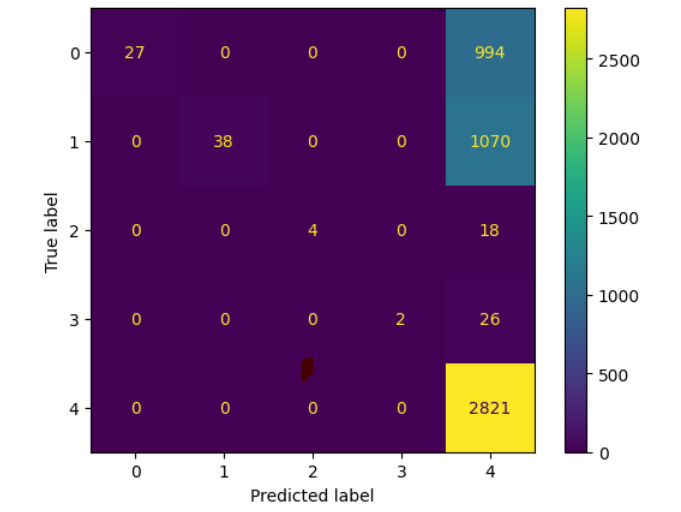

# **Online Retail II - Customer Behavior Analysis**

## **NON-TECHNICAL EXPLANATION OF THIS PROJECT**
This project analyzes customer behavior using the Online Retail II dataset to predict product demand, classify customer types, and segment customers based on their purchasing patterns. The aim is to help online retailers better understand customer preferences and improve their targeting strategies by using machine learning models like KNN, ARIMA, and clustering algorithms.

## **DATA**
The dataset used for this project is the **Online Retail II** dataset, which includes transactional data from a UK-based online retail store. It contains features such as product codes, prices, quantities, invoice details, customer IDs, and more. The data was used to predict sales, classify customers, and segment them based on their behaviors. This dataset is open source and can be found on the UCI Machine Learning Repository.

## **MODEL**
The project uses various models to analyze customer data:

1. **KNN**: Predicts the quantity demand of products based on historical transactions.
2. **ARIMA**: Used for forecasting daily total sales over the next 15 days.
3. **Logistic Regression**: Multinomial logistic regression to classify customers into returner categories.
4. **Random Forest**: A classifier to predict customer returner labels.
5. **XGBoost**: A gradient boosting classifier for predicting customer returner labels.
6. **KMeans**: A clustering algorithm to segment customers based on purchase behaviors.
7. **DBSCAN**: A density-based clustering algorithm for customer segmentation.

### **Why these models?**
- **KNN** is chosen for its simplicity and ability to recognize local patterns in demand data.
- **ARIMA** is used for short-term sales forecasting, based on time-series analysis.
- **Logistic Regression** and **Random Forest** are effective for classification tasks.
- **XGBoost** is selected for its high performance in classification with imbalanced datasets.
- **KMeans** and **DBSCAN** are used for customer segmentation based on behavioral patterns.

## **HYPERPARAMETER OPTIMISATION**
Hyperparameters were optimized for each model using cross-validation, grid search, or randomized search:

- **KNN**: Number of neighbors, distance metric, and weight type were tuned using randomized search.
- **Logistic Regression**: Features were scaled using RobustScaler, and PCA was applied for dimensionality reduction. SMOTE was used for balancing the dataset.
- **Random Forest**: Parameters like the number of trees, depth, and minimum samples for split and leaf were optimized.
- **XGBoost**: Hyperparameters like the number of trees, learning rate, and maximum depth were tuned using RandomizedSearchCV.
- **KMeans** and **DBSCAN**: The number of clusters and parameters like epsilon and minimum samples were optimized using silhouette scores.

## **RESULTS**
### **KNN**:
- Accuracy: 74.62% (MAPE)
- R² score: 47%
- Limitations: Struggles with sudden demand shifts.

- 

### **ARIMA**:
- AIC: 12044, Log likelihood: -6014
- Forecast: Daily total sales for the next 15 days.
- Limitations: Not suitable for long-term forecasts or sudden changes.

### **Logistic Regression**:
- Accuracy: 92.69% (with SMOTE)
- Limitations: Can overfit with synthetic SMOTE data.

### **Random Forest**:
- Accuracy: 80%
- Limitations: Struggles with recall for minority classes.

### **XGBoost**:
- Accuracy: 58%
- Limitations: Class imbalance, poor recall for smaller classes.

 

### **KMeans**:
- Silhouette Score: 0.97 (Excellent separation between clusters)
- Limitations: Assumes spherical, equally sized clusters.

### **DBSCAN**:
- Silhouette Score: 0.51 (Fairly good clustering with some noise)
- Limitations: Sensitive to the selection of eps and min_samples.

